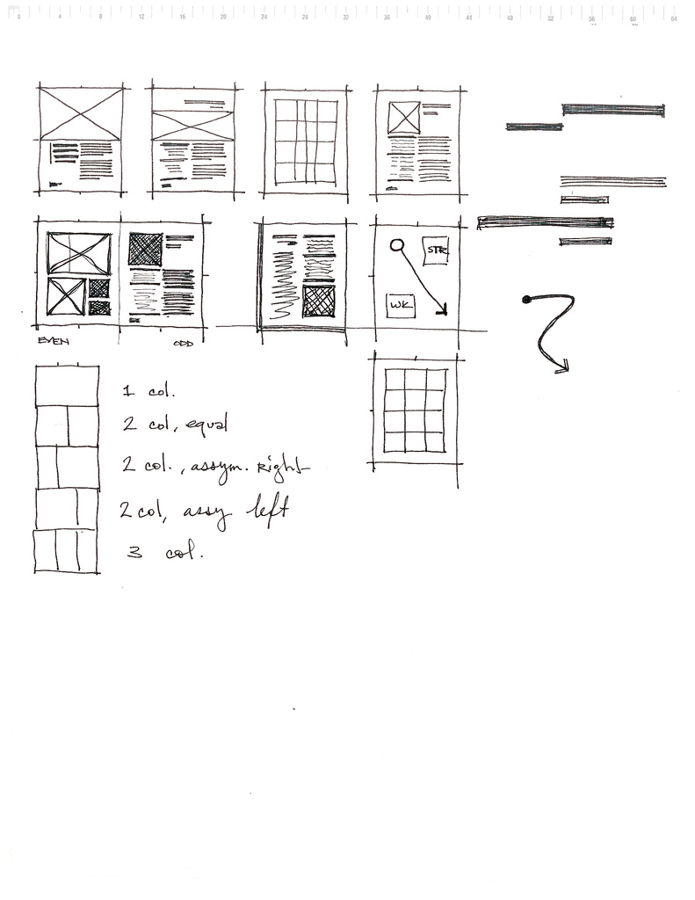

###############################
第 1 天：在浏览器里设计
###############################

或许你会抱怨自己不会 PS、没有设计感，所以无从下手设计我们的产品。
但想找一个专业的、不拖延设计师又是宇宙中排名前 10 的难题的之一 —— 所以我们大可以从最熟悉的工具开始设计产品的第一个页面。

使用最熟悉的工具
++++++++++++++++

最简单的方法就是找一张白纸和一支铅笔，在上面画出我们产品各个页面的大概轮廓：

Image from https://flic.kr/p/4dt6aw .

把草图搬进浏览器
++++++++++++++++

假如想要更好的交互效果，还（建议）可以将这个草图搬进我们的浏览器中：

.. image:: imgs/day0-index-sketch.png

`页面代码`_

.. _`页面代码`: ../../code/sketch/index.html

使用浏览器来进行设计
++++++++++++++++++++

在浏览器里进行设计的一个好处就是比 PhotoShop 会有更加直观交互。
通过直接调整页面元素的参数即可看到 **浏览器中** 的效果（这也是整个流程的关键点所在，毕竟你的设计最终还是要放到浏览器里供人浏览的）。

.. TODO:: example image

本节资源
++++++++++++++++++++

为了更快地做出一个简单的 sketch，我们可以使用 `Bootstrap`_ 等现成的框架来进行加工。

同时为了实时看到效果，我们也可以（必须）使用一个 livereload 工具来进行自动刷新。
在 ``code/sketch`` 文件夹中，我们已经提供了一个简单的 `Grunt`_ 脚本，安装好相关依赖后执行 ``grunt`` 即可让妈妈不再担心我们按坏 ``F5`` 了。

.. _`Bootstrap`: http://getbootstrap.com
.. _`Grunt`: http://gruntjs.com

本节拓展阅读
++++++++++++++++++++

`PSD To HTML Is Dead`_

`Design In GitHub`_

.. _`PSD To HTML Is Dead`: http://blog.teamtreehouse.com/psd-to-html-is-dead
.. _`Design In GitHub`: https://speakerdeck.com/muan/design-in-github
